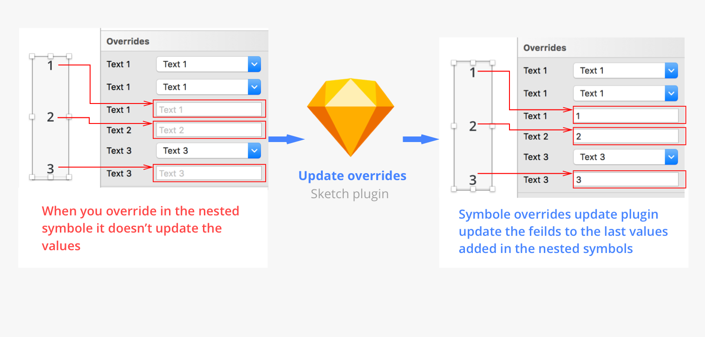

# Update Overrides Sketch plugin

If you are using Nested Nested Nested Symbols in your projects and suffering like me, I need your opinion.
Sometimes we do nested nested symbols and update the value of one of this nest but the problem I was always facing is if i create instance from this nested nested symbol it shows wrong default values that i don’t need in the Overrides.
